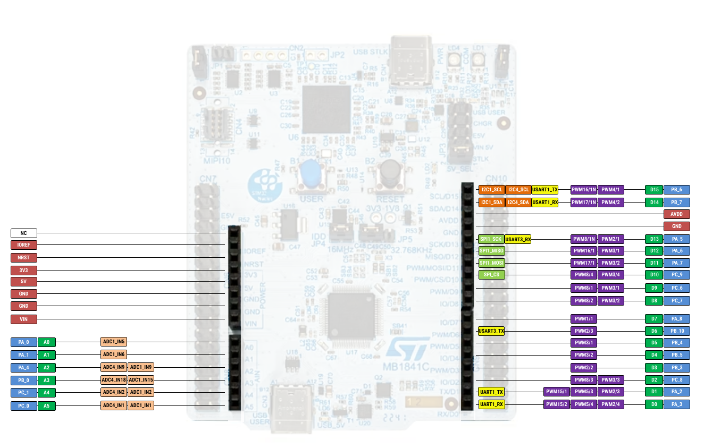
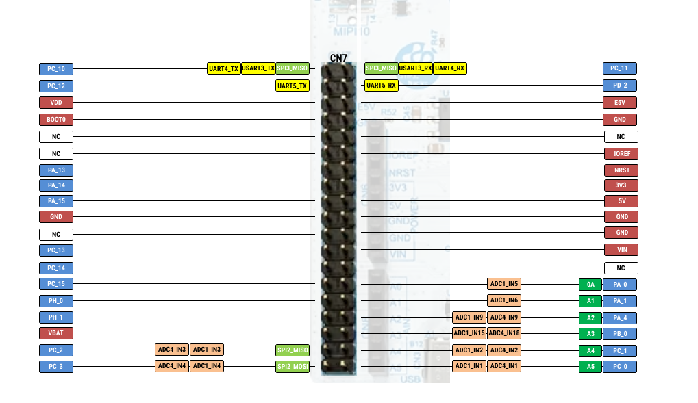
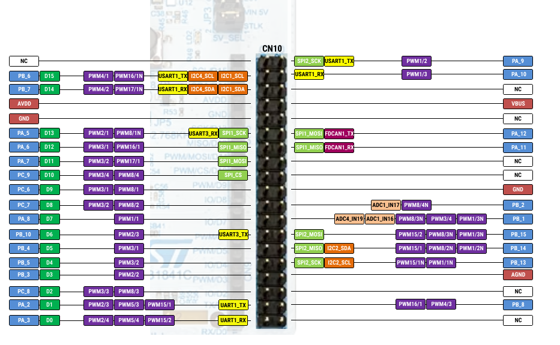

# STM32U5 Examples

# Spi (blocking & DMA) 
These examples use the BMP390 barometric pressure sensor, we send a read request to register 0x00 and we wait for the chip ID response (0x60). 
The examples were tested on the nucleo_u545re_q board.

Please refer to the Figure 1 for the pin connections reference.

STM32 D10/PC_9 -> BMP390_CSB

STM32 D11/PA_7 -> BMP390_SDI

STM32 D12/PA_6 -> BMP390_SDO

STM32 D13/PA_5 -> BMP390_SCK

